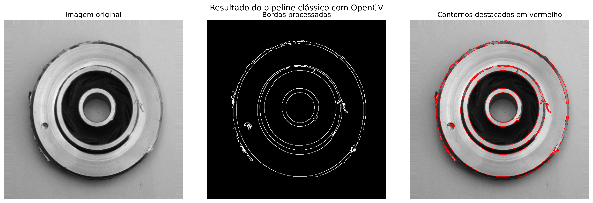
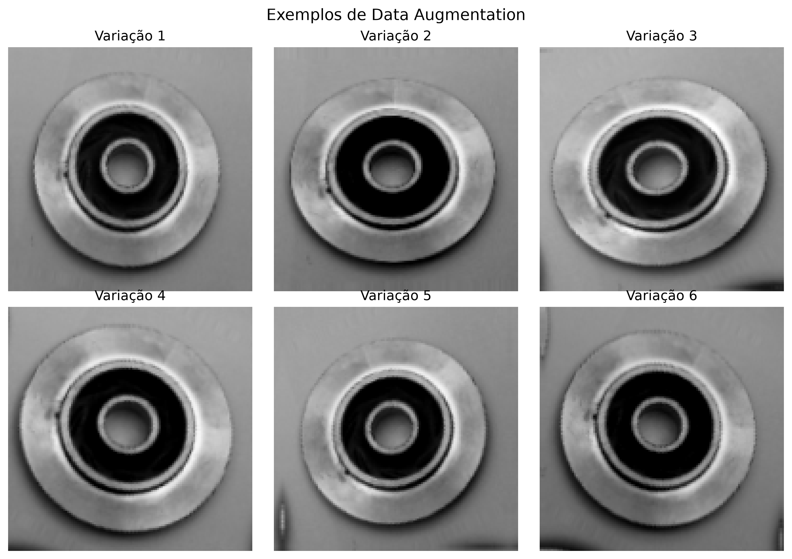
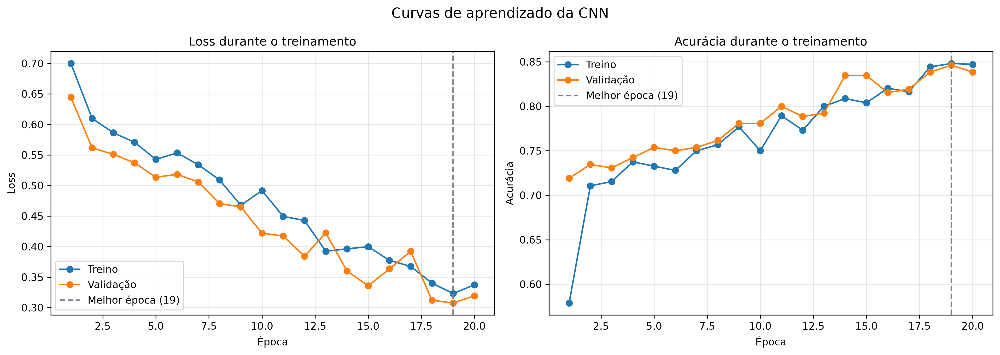
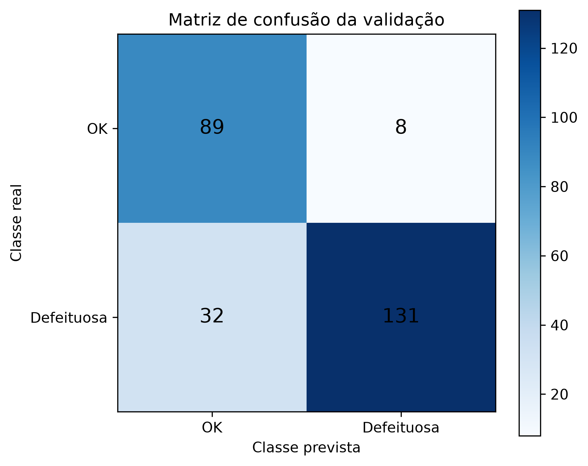
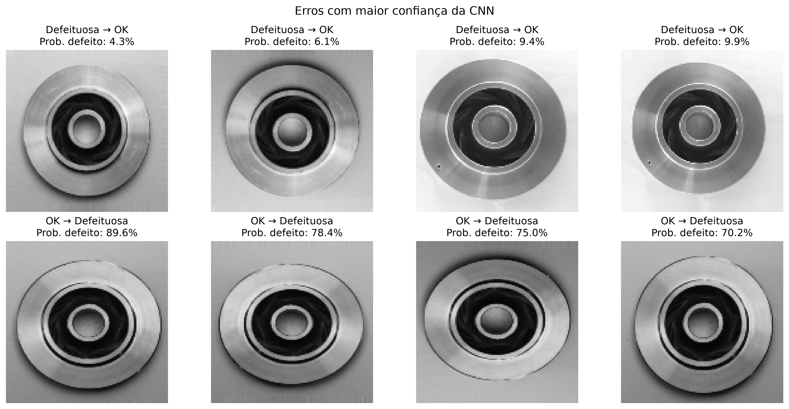

# Inspeção Visual de Peças Metálicas com OpenCV e CNN

Mini-projeto de Machine Learning e Visão Computacional desenvolvido para o programa SCTEC.

O projeto combina técnicas clássicas de processamento de imagens com uma Rede Neural Convolucional para analisar e classificar peças metálicas como **OK** ou **Defeituosas**.

## Objetivos

O projeto possui dois objetivos principais:

1. Aplicar um pipeline clássico com OpenCV para destacar contornos, cavidades e irregularidades nas peças.
2. Treinar uma CNN com TensorFlow/Keras para realizar a classificação binária das imagens.

## Dataset

Foi utilizado o dataset **Casting Product Image Data for Quality Inspection**, contendo imagens de peças metálicas com e sem defeitos.

Distribuição das imagens:

| Classe | Quantidade | Percentual |
|---|---:|---:|
| Defeituosa | 781 | 60,1% |
| OK | 519 | 39,9% |
| Total | 1.300 | 100% |

Todas as imagens possuem:

- resolução original de 512 × 512 pixels;
- três canais;
- formato JPEG;
- tipo de dados `uint8`;
- nenhum arquivo inválido identificado.

> O dataset não está incluído no repositório devido ao seu tamanho.

## Pipeline clássico com OpenCV

A análise exploratória foi desenvolvida com as seguintes etapas:

1. carregamento das imagens;
2. conversão para escala de cinza;
3. suavização com Gaussian Blur;
4. limiarização automática com Otsu;
5. detecção de bordas com Canny;
6. dilatação e erosão;
7. sobreposição dos contornos na imagem original.



O pipeline destacou cavidades e irregularidades presentes nas peças. Entretanto, também identificou contornos normais do componente, demonstrando que o processamento clássico auxilia na análise, mas não realiza sozinho a classificação.

## Classificação com CNN

As imagens foram redimensionadas para 128 × 128 pixels e divididas em:

- 80% para treinamento: 1.040 imagens;
- 20% para validação: 260 imagens.

A ordem dos rótulos foi definida como:

- `0`: OK;
- `1`: Defeituosa.

### Data Augmentation

Foram aplicadas transformações dinâmicas de:

- rotação;
- zoom;
- contraste;
- brilho.



### Arquitetura

A CNN foi construída com:

- três camadas `Conv2D`;
- três camadas `MaxPooling2D`;
- normalização com `Rescaling`;
- camada `Flatten`;
- camada densa com 64 neurônios;
- `Dropout` de 40%;
- saída binária com ativação `sigmoid`.

O modelo possui **1.072.289 parâmetros treináveis**.

A compilação utilizou:

- otimizador Adam;
- perda `binary_crossentropy`;
- métricas de acurácia, precisão e recall.

## Treinamento

O treinamento foi configurado para no máximo 20 épocas, utilizando:

- pesos para compensar o desbalanceamento das classes;
- `EarlyStopping`;
- `ModelCheckpoint`;
- restauração dos pesos da melhor época.

A melhor época foi a **19**, com:

- `val_loss`: 0,3075;
- `val_accuracy`: 84,62%.



As curvas de treino e validação permaneceram próximas, sem evidência significativa de overfitting.

## Resultados

| Métrica | Resultado |
|---|---:|
| Acurácia | 84,62% |
| Precisão | 94,24% |
| Recall | 80,37% |
| F1-score | 86,75% |
| Especificidade | 91,75% |



A matriz de confusão apresentou:

- 89 peças OK classificadas corretamente;
- 131 peças defeituosas identificadas corretamente;
- 8 falsos positivos;
- 32 falsos negativos.

Em inspeções industriais, os falsos negativos são especialmente importantes, pois representam peças defeituosas aprovadas pelo sistema.

## Análise dos erros

Os falsos negativos apresentaram defeitos pequenos ou com baixo contraste. O redimensionamento para 128 × 128 pixels pode ter reduzido a visibilidade dessas características.

Algumas peças OK foram classificadas como defeituosas devido a sombras, variações de iluminação ou contornos mais intensos.



## Estrutura do projeto

```text
sctec-inspecao-qualidade-cnn/
├── data/
│   └── raw/
│       └── casting_512x512/
│           ├── def_front/
│           └── ok_front/
├── docs/
├── models/
├── notebooks/
│   ├── 01_analise_exploratoria_opencv.ipynb
│   └── 02_classificacao_cnn.ipynb
├── outputs/
│   └── figures/
├── src/
│   ├── __init__.py
│   └── processamento_opencv.py
├── tests/
├── .gitignore
├── pyproject.toml
├── uv.lock
└── README.md
```

## Tecnologias utilizadas

- Python 3.13
- UV
- OpenCV
- NumPy
- Matplotlib
- TensorFlow
- Keras
- Jupyter Notebook
- Git e GitHub

## Como executar

### 1. Clonar o repositório

```powershell
git clone https://github.com/MarcioLuizBR/sctec-inspecao-qualidade-cnn.git
cd sctec-inspecao-qualidade-cnn
```

### 2. Criar o ambiente e instalar as dependências

```powershell
uv sync
```

### 3. Ativar o ambiente no Windows

```powershell
.venv\Scripts\Activate.ps1
```

### 4. Adicionar o dataset

Extraia o dataset dentro de:

```text
data/raw/casting_512x512/
```

A estrutura deve conter:

```text
casting_512x512/
├── def_front/
└── ok_front/
```

### 5. Executar os notebooks

Abra os notebooks no VS Code e selecione o interpretador:

```text
.venv\Scripts\python.exe
```

Execute na seguinte ordem:

1. `01_analise_exploratoria_opencv.ipynb`
2. `02_classificacao_cnn.ipynb`

O melhor modelo treinado será salvo localmente em:

```text
models/melhor_modelo_cnn.keras
```

## Possíveis melhorias

- testar imagens com maior resolução;
- ajustar o limiar de decisão para aumentar o recall;
- avaliar arquiteturas mais profundas;
- utilizar Transfer Learning;
- ampliar o dataset;
- testar o modelo em um conjunto independente.

## Vídeo de apresentação

O link do vídeo será adicionado após a gravação.

## Autor

**Márcio Luiz dos Santos Pereira**

[GitHub](https://github.com/MarcioLuizBR)